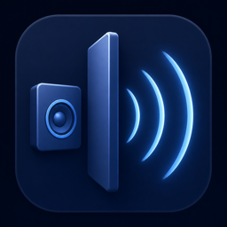

# Behind the Wall

  

A native macOS menu bar app that makes music sound as if it were playing in the next room. Behind the Wall combines a strong low-pass filter, bass emphasis, room reflections, echo, distance attenuation, and optional output gain.

The app is called **«За стеной»** in the macOS interface and **NextDoor** internally.

## Features

- Process all system audio or only a selected application.
- Keep a browser or video player clean while applying the effect to a music app.
- Group Electron and Chromium audio helper processes with their parent app.
- Adjust wall strength, distance, bass, room reflections, echo, and output gain.
- Save named presets and automatically restore the latest manual settings.
- Toggle the effect from the menu bar or a macOS Control Center control.
- Bypass every effect cleanly when all sliders are at zero.

## Requirements

- macOS 26 or newer.
- System Audio Recording permission.
- Xcode 26 or newer when building from source.

## Installation

### Prebuilt app

Download the latest archive from [Releases](https://github.com/alexup71rus/BehindTheWall/releases), unzip it, and open `NextDoor.app`.

The current build is ad-hoc signed and not notarized. On first launch, macOS may require you to right-click the app, choose **Open**, and confirm. Allow **System Audio Recording** when prompted.

### Build from source

1. Open `NextDoor.xcodeproj` in Xcode.
2. Select the `NextDoor` scheme.
3. Build and run the app.
4. Allow **System Audio Recording** when macOS asks.

## Usage

1. Open the waveform icon in the menu bar.
2. Choose **Весь системный звук** or a specific app under **Источник**.
3. Turn on the effect and adjust the sliders.
4. Save useful combinations as named presets.

If an app is missing from the source list, launch it and choose **Обновить список**. A browser is treated as one source, so individual tabs cannot be processed separately.

## How it works

Behind the Wall uses a private Core Audio process tap and a temporary aggregate audio device. Selected audio is muted only while the app is actively reading it, processed in a real-time DSP callback, and written directly to the current physical output device.

The app does not use the microphone, record audio, upload data, or require a virtual audio driver. The tap and aggregate device are destroyed when the effect is switched off or the app exits.

## License

[MIT](LICENSE)

---

## По-русски

«За стеной» — нативное menu bar-приложение для macOS 26, которое делает музыку похожей на звук из соседней комнаты. Можно обработать весь системный звук или только отдельное приложение, настроить стену, расстояние, бас, комнату, эхо и усиление, а затем сохранить результат как пресет.
